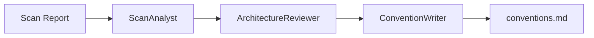
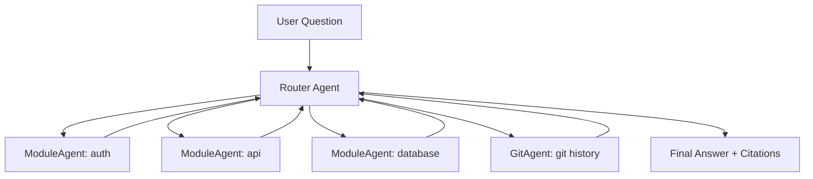

# 🔥 Multi-Agent Collaboration Model

## 🪐 Architecture Overview

RepoBrain uses two specialized Agent Swarms to power its core functionality:

1. **Refresh Swarm** — Scans the project and generates knowledge artifacts
2. **Ask Swarm** — Answers codebase questions using the generated knowledge base

These swarms are defined in `engine/repobrain_engine/hub/agents.py` and driven by `refresh_pipeline.py` and `ask_pipeline.py`.

## 🔄 Refresh Swarm: Three-Stage Analysis Chain

When you run `rb-refresh`, the Refresh Swarm analyzes your codebase and generates a project conventions document.

### Architecture: Three-Agent Handoff Chain



### The Three Agent Roles

#### 🔍 ScanAnalyst
**Responsibility:** Code analysis specialist focusing on language and framework detection

**Analyzes:**
- Programming languages and their distribution (primary vs secondary)
- Detected frameworks and libraries (web, data, ML, etc.)
- Code patterns and style observations (naming, structure, idioms)
- Dependency management approach

Hands off to ArchitectureReviewer when complete.

#### 🏗️ ArchitectureReviewer
**Responsibility:** Software architecture reviewer

**Analyzes:**
- Project directory structure and organization patterns
- Testing approach, framework, and coverage indicators
- CI/CD pipeline setup and automation
- Docker/container configuration
- Build system and packaging approach
- Configuration management patterns

Builds on the previous agent's analysis and adds structural findings, then hands off to ConventionWriter.

#### ✍️ ConventionWriter
**Responsibility:** Technical documentation writer specialist

**Produces:**
Using ALL analysis from the previous agents, produces a concise conventions document (Markdown format) covering:
- Primary language(s) and framework(s)
- Project structure overview
- Code style observations
- Testing approach
- CI/CD setup

Keeps it under 300 words, outputs ONLY Markdown content.

### Implementation Location

- **Code:** `build_refresh_swarm()` in `engine/repobrain_engine/hub/agents.py`
- **Pipeline:** `engine/repobrain_engine/hub/refresh_pipeline.py`
- **Storage:** Generated knowledge saved to `.repobrain/` directory (in target project, not this repo)

### Host-Runner Mode

When no API key is configured (`RB_HOST_RUNNER` set to `codex` or `generic`), Refresh uses a single-turn, tool-free Convention Agent (`build_single_turn_convention_agent()`) that collapses the three-stage chain into one generation.

## 💬 Ask Swarm: Dynamic Module Router

When you run `rb-ask "question"`, the Ask Swarm routes your question to the relevant module's agent and returns an answer with file paths and line numbers.

### Architecture: Router-Worker Pattern



### Agent Roles

#### 🧭 Router Agent
**Responsibility:** Question routing and answer synthesis

**Workflow:**
1. Reads the user's question
2. Identifies relevant module(s) based on project structure map
3. Hands off to the appropriate ModuleAgent
4. For git-related questions (recent changes, commit history), hands off to GitAgent
5. For cross-module questions, hands off to one module first; that module can hand off to others as needed
6. Synthesizes findings from agents into a final answer

**Answer Requirements:**
- Lead with a direct answer to the question
- **Cite specific file paths, line numbers, and function names**
- Include commit history when it explains "why"
- Be concise (under 200 words unless the question demands more)

#### 📦 ModuleAgent (Dynamically Created)
**Responsibility:** Deep knowledge of a specific module

Each module gets its own agent with:
- Module's structured facts (JSON claims + source evidence)
- Tools to explore code (read_file, search_code, etc.)
- Ability to hand off to other ModuleAgents for cross-module information

ModuleAgents are created dynamically based on the project scan (one agent per detected module).

#### 📜 GitAgent
**Responsibility:** Git history and change analysis

Handles questions about:
- Recent commits and changes
- Who changed what
- Change history and rationale
- Blame information

### Implementation Location

- **Code:** Router and ModuleAgent building logic in `engine/repobrain_engine/hub/agents.py`
- **Pipeline:** `engine/repobrain_engine/hub/ask_pipeline.py`
- **Knowledge:** Reads from generation directory pointed to by `.repobrain/current.json`

### Fallback Strategy

The ask pipeline implements a three-tier fallback mechanism:

1. **`_ask_with_structured_facts`** — Uses structured facts (JSON claims + source verification)
2. **`_ask_with_agent_md`** — Falls back to agent.md files (plain text knowledge)
3. **`_ask_with_legacy_swarm`** — Final fallback (if both fail)

This ensures ask functionality remains available even if knowledge base is partially generated or uses older formats.

## 🔧 Configuration & Extension

### Using Different LLM Backends

1. **API-based (standard):**
   ```bash
   rb-setup  # Choose OpenAI, DeepSeek, Groq, etc.
   ```

2. **Host-runner (no API key):**
   ```bash
   export RB_HOST_RUNNER=codex  # or generic
   # Uses logged-in IDE CLI, no API key needed
   ```

3. **Custom OpenAI-compatible endpoint:**
   ```bash
   export OPENAI_BASE_URL=https://your-endpoint.com/v1
   export OPENAI_API_KEY=your-key
   export OPENAI_MODEL=your-model
   ```

### Incremental Refresh (`--quick`)

For clean worktrees with committed changes:

```bash
rb-refresh --quick
```

This triggers incremental refresh:
- **ImpactPlanner** analyzes git diff to determine affected modules
- **ImpactVerifier** verifies impact analysis
- Only affected agent-groups are refreshed
- Significantly speeds up iteration on large codebases

Implementation: `engine/repobrain_engine/hub/incremental.py`

## 📊 Workflow Examples

### Example 1: Initialize New Project

```bash
# 1. Set up backend
rb-setup

# 2. Scan project and build knowledge base
rb-refresh

# 3. Verify knowledge base
rb report  # Shows detected modules, languages, etc.

# 4. Start asking questions
rb-ask "How does authentication work?"
```

### Example 2: Incremental Updates

```bash
# Make some changes and commit
git add .
git commit -m "Update auth logic"

# Quick incremental refresh (only affected modules)
rb-refresh --quick

# Verify updates
rb-ask "What changed in the auth module?"
```

### Example 3: Debugging Usage

```bash
# Refresh with debug logging
RB_LOG_LEVEL=DEBUG rb-refresh

# Ask with verbose output
RB_LOG_LEVEL=DEBUG rb-ask "Where is the database connection?"
```

## 🐛 Troubleshooting

### Agent Initialization Fails

```bash
# Check if Agent SDK is installed
pip show openai-agents

# Verify LLM configuration
cat .env | grep OPENAI
```

### Incomplete Knowledge Base

```bash
# Check refresh status
rb report

# Force full refresh (non-incremental)
rb-refresh  # without --quick

# Check generation logs
ls -la .repobrain/
cat .repobrain/current.json
```

### Ask Returns "Not Found"

Possible causes:
1. Knowledge base not generated or stale → Run `rb-refresh`
2. Module not detected by scanner → Check `rb report` output
3. Question routed to wrong module → Try more specific question

## 🔗 MCP Integration

RepoBrain exposes its core functionality as MCP tools via `rb-mcp`:

- **`ask_project`** — Answer codebase questions
- **`refresh_project`** — Refresh knowledge base

MCP server implementation: `engine/repobrain_engine/hub/mcp_server.py`

## 🚀 Performance Tips

### Speed Up Refresh
- Use `--quick` for incremental updates (clean worktree after commit)
- Exclude unnecessary directories (configure ignore patterns in `.repobrain/config.json`)
- Use faster models (e.g., GPT-4o-mini or Claude 3.5 Haiku)

### Improve Answer Quality
- Keep knowledge base up to date (run `rb-refresh` regularly)
- Ask specific questions (mention file names, features, or modules)
- Use higher-capability models for complex queries

## 📚 References

### Core Files
- `engine/repobrain_engine/hub/agents.py` — Agent definitions
- `engine/repobrain_engine/hub/refresh_pipeline.py` — Refresh workflow
- `engine/repobrain_engine/hub/ask_pipeline.py` — Ask workflow
- `engine/repobrain_engine/hub/incremental.py` — Incremental refresh
- `engine/repobrain_engine/hub/host_runner.py` — Local CLI backend
- `engine/repobrain_engine/hub/storage.py` — Knowledge storage

### Related Documentation
- [Project Philosophy](PHILOSOPHY.md) — Product boundaries and support scope
- [Zero-Config Features](ZERO_CONFIG.md) — Tool and context discovery
- [Quick Start](QUICK_START.md) — Installation and first steps

---

**Next:** [Zero-Config Features](ZERO_CONFIG.md) | [Full Index](README.md)
