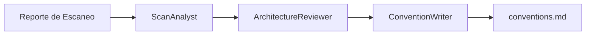
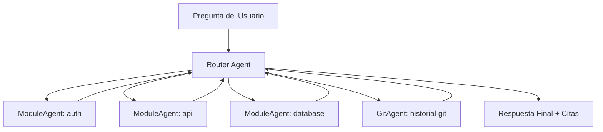

# 🔥 Modelo de Colaboración Multi-Agente

## 🪐 Descripción General de la Arquitectura

RepoBrain utiliza dos Swarms de Agentes especializados para impulsar su funcionalidad central:

1. **Refresh Swarm** — Escanea el proyecto y genera artefactos de conocimiento
2. **Ask Swarm** — Responde preguntas sobre el codebase usando la base de conocimiento generada

Estos swarms están definidos en `engine/repobrain_engine/hub/agents.py` e impulsados por `refresh_pipeline.py` y `ask_pipeline.py`.

## 🔄 Refresh Swarm: Cadena de Análisis en Tres Etapas

Cuando ejecutas `rb-refresh`, el Refresh Swarm analiza tu codebase y genera un documento de convenciones del proyecto.

### Arquitectura: Cadena de Handoff de Tres Agentes



### Los Tres Roles de Agentes

#### 🔍 ScanAnalyst
**Responsabilidad:** Especialista en análisis de código enfocado en detección de lenguajes y frameworks

**Analiza:**
- Lenguajes de programación y su distribución (primarios vs secundarios)
- Frameworks y bibliotecas detectados (web, datos, ML, etc.)
- Observaciones de patrones y estilos de código (nomenclatura, estructura, idiomas)
- Enfoque de gestión de dependencias

Pasa el control a ArchitectureReviewer al completar.

#### 🏗️ ArchitectureReviewer
**Responsabilidad:** Revisor de arquitectura de software

**Analiza:**
- Estructura de directorios del proyecto y patrones de organización
- Enfoque de pruebas, framework e indicadores de cobertura
- Configuración de pipeline CI/CD y automatización
- Configuración de Docker/contenedores
- Sistema de construcción y enfoque de empaquetado
- Patrones de gestión de configuración

Se basa en el análisis del agente anterior y añade hallazgos estructurales, luego pasa el control a ConventionWriter.

#### ✍️ ConventionWriter
**Responsabilidad:** Especialista en redacción de documentación técnica

**Produce:**
Usando TODO el análisis de los agentes anteriores, produce un documento de convenciones conciso (formato Markdown) que cubre:
- Lenguaje(s) y framework(s) principales
- Descripción general de la estructura del proyecto
- Observaciones de estilo de código
- Enfoque de pruebas
- Configuración CI/CD

Lo mantiene bajo 300 palabras, genera SOLO contenido Markdown.

### Ubicación de Implementación

- **Código:** `build_refresh_swarm()` en `engine/repobrain_engine/hub/agents.py`
- **Pipeline:** `engine/repobrain_engine/hub/refresh_pipeline.py`
- **Almacenamiento:** Conocimiento generado guardado en directorio `.repobrain/` (en proyecto objetivo, no en este repo)

### Modo Host-Runner

Cuando no hay API key configurada (`RB_HOST_RUNNER` establecido en `codex` o `generic`), Refresh usa un Agente de Convenciones de turno único sin herramientas (`build_single_turn_convention_agent()`) que colapsa la cadena de tres etapas en una sola generación.

## 💬 Ask Swarm: Enrutador de Módulos Dinámico

Cuando ejecutas `rb-ask "pregunta"`, el Ask Swarm enruta tu pregunta al agente del módulo relevante y devuelve una respuesta con rutas de archivo y números de línea.

### Arquitectura: Patrón Router-Worker



### Roles de Agentes

#### 🧭 Router Agent
**Responsabilidad:** Enrutamiento de preguntas y síntesis de respuestas

**Flujo de Trabajo:**
1. Lee la pregunta del usuario
2. Identifica módulo(s) relevante(s) basado en el mapa de estructura del proyecto
3. Pasa el control al ModuleAgent apropiado
4. Para preguntas relacionadas con git (cambios recientes, historial de commits), pasa el control a GitAgent
5. Para preguntas entre módulos, pasa el control a un módulo primero; ese módulo puede pasar el control a otros según sea necesario
6. Sintetiza los hallazgos de los agentes en una respuesta final

**Requisitos de Respuesta:**
- Comenzar con una respuesta directa a la pregunta
- **Citar rutas de archivo específicas, números de línea y nombres de funciones**
- Incluir historial de commits cuando explique el "por qué"
- Ser conciso (bajo 200 palabras a menos que la pregunta demande más)

#### 📦 ModuleAgent (Creado Dinámicamente)
**Responsabilidad:** Conocimiento profundo de un módulo específico

Cada módulo obtiene su propio agente con:
- Facts estructurados del módulo (claims JSON + evidencia de fuente)
- Herramientas para explorar código (read_file, search_code, etc.)
- Capacidad de pasar el control a otros ModuleAgents para información entre módulos

Los ModuleAgents se crean dinámicamente basados en el escaneo del proyecto (un agente por módulo detectado).

#### 📜 GitAgent
**Responsabilidad:** Historial de Git y análisis de cambios

Maneja preguntas sobre:
- Commits recientes y cambios
- Quién cambió qué
- Historial de cambios y justificación
- Información de blame

### Ubicación de Implementación

- **Código:** Lógica de construcción de Router y ModuleAgent en `engine/repobrain_engine/hub/agents.py`
- **Pipeline:** `engine/repobrain_engine/hub/ask_pipeline.py`
- **Conocimiento:** Lee del directorio de generación apuntado por `.repobrain/current.json`

### Estrategia de Fallback

El pipeline de ask implementa un mecanismo de fallback de tres niveles:

1. **`_ask_with_structured_facts`** — Usa facts estructurados (claims JSON + verificación de fuente)
2. **`_ask_with_agent_md`** — Recurre a archivos agent.md (conocimiento en texto plano)
3. **`_ask_with_legacy_swarm`** — Fallback final (si ambos fallan)

Esto asegura que la funcionalidad ask permanezca disponible incluso si la base de conocimiento está parcialmente generada o usa formatos antiguos.

## 🔧 Configuración y Extensión

### Usando Diferentes Backends LLM

1. **Basado en API (estándar):**
   ```bash
   rb-setup  # Elige OpenAI, DeepSeek, Groq, etc.
   ```

2. **Host-runner (sin API key):**
   ```bash
   export RB_HOST_RUNNER=codex  # o generic
   # Usa IDE CLI con sesión iniciada, no se necesita API key
   ```

3. **Endpoint personalizado compatible con OpenAI:**
   ```bash
   export OPENAI_BASE_URL=https://tu-endpoint.com/v1
   export OPENAI_API_KEY=tu-key
   export OPENAI_MODEL=tu-modelo
   ```

### Actualización Incremental (`--quick`)

Para árboles de trabajo limpios con cambios confirmados:

```bash
rb-refresh --quick
```

Esto activa la actualización incremental:
- **ImpactPlanner** analiza git diff para determinar módulos afectados
- **ImpactVerifier** verifica el análisis de impacto
- Solo se actualizan los agent-groups afectados
- Acelera significativamente la iteración en codebases grandes

Implementación: `engine/repobrain_engine/hub/incremental.py`

## 📊 Ejemplos de Flujo de Trabajo

### Ejemplo 1: Inicializar Nuevo Proyecto

```bash
# 1. Configurar backend
rb-setup

# 2. Escanear proyecto y construir base de conocimiento
rb-refresh

# 3. Verificar base de conocimiento
rb report  # Muestra módulos detectados, lenguajes, etc.

# 4. Comenzar a hacer preguntas
rb-ask "¿Cómo funciona la autenticación?"
```

### Ejemplo 2: Actualizaciones Incrementales

```bash
# Hacer algunos cambios y confirmar
git add .
git commit -m "Actualizar lógica de auth"

# Actualización incremental rápida (solo módulos afectados)
rb-refresh --quick

# Verificar actualizaciones
rb-ask "¿Qué cambió en el módulo auth?"
```

### Ejemplo 3: Uso de Depuración

```bash
# Actualizar con logging de depuración
RB_LOG_LEVEL=DEBUG rb-refresh

# Preguntar con salida verbosa
RB_LOG_LEVEL=DEBUG rb-ask "¿Dónde está la conexión de base de datos?"
```

## 🐛 Solución de Problemas

### Falla la Inicialización del Agente

```bash
# Verificar si el SDK del Agente está instalado
pip show openai-agents

# Verificar configuración LLM
cat .env | grep OPENAI
```

### Base de Conocimiento Incompleta

```bash
# Verificar estado de actualización
rb report

# Forzar actualización completa (no incremental)
rb-refresh  # sin --quick

# Verificar logs de generación
ls -la .repobrain/
cat .repobrain/current.json
```

### Ask Devuelve "No Encontrado"

Posibles causas:
1. Base de conocimiento no generada o obsoleta → Ejecutar `rb-refresh`
2. Módulo no detectado por el escáner → Verificar salida de `rb report`
3. Pregunta enrutada al módulo incorrecto → Probar pregunta más específica

## 🔗 Integración MCP

RepoBrain expone su funcionalidad central como herramientas MCP vía `rb-mcp`:

- **`ask_project`** — Responder preguntas del codebase
- **`refresh_project`** — Actualizar base de conocimiento

Implementación del servidor MCP: `engine/repobrain_engine/hub/mcp_server.py`

## 🚀 Consejos de Rendimiento

### Acelerar Actualización
- Usar `--quick` para actualizaciones incrementales (árbol de trabajo limpio después de commit)
- Excluir directorios innecesarios (configurar patrones de ignorar en `.repobrain/config.json`)
- Usar modelos más rápidos (ej., GPT-4o-mini o Claude 3.5 Haiku)

### Mejorar Calidad de Respuesta
- Mantener base de conocimiento actualizada (ejecutar `rb-refresh` regularmente)
- Hacer preguntas específicas (mencionar nombres de archivos, características o módulos)
- Usar modelos de mayor capacidad para consultas complejas

## 📚 Referencias

### Archivos Principales
- `engine/repobrain_engine/hub/agents.py` — Definiciones de agentes
- `engine/repobrain_engine/hub/refresh_pipeline.py` — Flujo de actualización
- `engine/repobrain_engine/hub/ask_pipeline.py` — Flujo de preguntas
- `engine/repobrain_engine/hub/incremental.py` — Actualización incremental
- `engine/repobrain_engine/hub/host_runner.py` — Backend CLI local
- `engine/repobrain_engine/hub/storage.py` — Almacenamiento de conocimiento

### Documentación Relacionada
- [Filosofía del Proyecto](PHILOSOPHY.md) — Límites del producto y alcance de soporte
- [Características Zero-Config](ZERO_CONFIG.md) — Descubrimiento de herramientas y contexto
- [Inicio Rápido](QUICK_START.md) — Instalación y primeros pasos

---

**Siguiente:** [Características Zero-Config](ZERO_CONFIG.md) | [Índice Completo](README.md)
