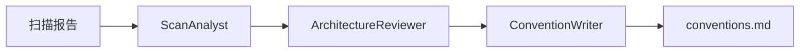
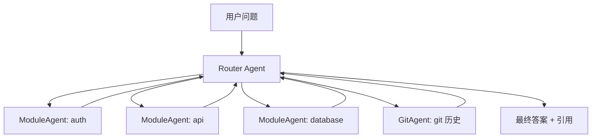

# 🔥 多 Agent 协作模型

## 🪐 架构概述

RepoBrain 使用两个专门的 Agent Swarm 来支持其核心功能：

1. **Refresh Swarm** — 扫描项目并生成知识工件
2. **Ask Swarm** — 基于生成的知识库回答代码库问题

这些 Swarm 定义在 `engine/repobrain_engine/hub/agents.py` 中，由 `refresh_pipeline.py` 和 `ask_pipeline.py` 驱动。

## 🔄 Refresh Swarm：三阶段分析链

当你运行 `rb-refresh` 时，Refresh Swarm 会分析你的代码库并生成项目约定文档。

### 架构：三阶段 Handoff 链



### 三个 Agent 角色

#### 🔍 ScanAnalyst
**职责：** 代码分析专家，专注于语言和框架检测

**分析内容：**
- 编程语言及其分布（主要 vs 次要）
- 检测到的框架和库（web、数据、ML 等）
- 代码模式和风格观察（命名、结构、习惯用法）
- 依赖管理方式

完成后移交给 ArchitectureReviewer。

#### 🏗️ ArchitectureReviewer
**职责：** 软件架构审查员

**分析内容：**
- 项目目录结构和组织模式
- 测试方法、框架和覆盖率指标
- CI/CD 管道设置和自动化
- Docker/容器配置
- 构建系统和打包方式
- 配置管理模式

在前一个 Agent 分析的基础上添加结构性发现，然后移交给 ConventionWriter。

#### ✍️ ConventionWriter
**职责：** 技术文档撰写专家

**输出内容：**
使用前两个 Agent 的所有分析结果，生成简洁的约定文档（Markdown 格式），涵盖：
- 主要语言和框架
- 项目结构概述
- 代码风格观察
- 测试方法
- CI/CD 设置

输出保持在 300 字以内，直接输出 Markdown 内容。

### 实现位置

- **代码：** `engine/repobrain_engine/hub/agents.py` 中的 `build_refresh_swarm()`
- **管道：** `engine/repobrain_engine/hub/refresh_pipeline.py`
- **存储：** 生成的知识保存在 `.repobrain/` 目录（在目标项目中，非本仓库）

### Host-Runner 模式

当没有配置 API key 时（`RB_HOST_RUNNER` 设置为 `codex` 或 `generic`），Refresh 会使用单轮、无工具的 Convention Agent (`build_single_turn_convention_agent()`)，该 Agent 将三阶段链压缩为一次生成。

## 💬 Ask Swarm：动态模块路由

当你运行 `rb-ask "问题"` 时，Ask Swarm 会将问题路由到相关模块的 Agent 并返回带有文件路径和行号的答案。

### 架构：Router-Worker 模式



### Agent 角色

#### 🧭 Router Agent
**职责：** 问题路由和答案综合

**功能：**
1. 读取用户问题
2. 基于项目结构图识别相关模块
3. 将问题移交给适当的 ModuleAgent
4. 对于 git 相关问题（最近更改、提交历史），移交给 GitAgent
5. 对于跨模块问题，先移交给一个模块，该模块可根据需要移交给其他模块
6. 综合 Agent 返回的发现，生成最终答案

**答案要求：**
- 直接回答问题
- **引用具体的文件路径、行号和函数名**
- 包含提交历史（解释"为什么"）
- 简洁明了（除非问题需要更多细节，否则保持 200 字以内）

#### 📦 ModuleAgent（动态生成）
**职责：** 负责特定模块的深度知识

每个模块都有自己的 Agent，具有：
- 模块的结构化 facts（JSON claims + 源码证据）
- 探索代码的工具（read_file、search_code 等）
- 可以移交给其他 ModuleAgent 以获取跨模块信息

ModuleAgent 根据项目扫描结果动态创建（每个检测到的模块一个 Agent）。

#### 📜 GitAgent
**职责：** Git 历史和变更分析

处理关于：
- 最近的提交和更改
- 谁修改了什么
- 变更历史和原因
- Blame 信息

### 实现位置

- **代码：** `engine/repobrain_engine/hub/agents.py` 中的 Router 和 ModuleAgent 构建逻辑
- **管道：** `engine/repobrain_engine/hub/ask_pipeline.py`
- **知识库：** 从 `.repobrain/current.json` 指向的生成目录读取

### 回退策略

Ask pipeline 实现了三层回退机制：

1. **`_ask_with_structured_facts`** — 使用结构化 facts（JSON claims + 源码验证）
2. **`_ask_with_agent_md`** — 回退到 agent.md 文件（纯文本知识）
3. **`_ask_with_legacy_swarm`** — 最终回退（如果前两者都失败）

这确保了即使知识库部分生成或使用旧格式，ask 功能仍然可用。

## 🔧 配置与扩展

### 使用不同的 LLM 后端

1. **API-based（标准方式）：**
   ```bash
   rb-setup  # 选择 OpenAI、DeepSeek、Groq 等
   ```

2. **Host-runner（无 API key）：**
   ```bash
   export RB_HOST_RUNNER=codex  # 或 generic
   # 使用登录的 IDE CLI，无需 API key
   ```

3. **自定义 OpenAI-compatible endpoint：**
   ```bash
   export OPENAI_BASE_URL=https://your-endpoint.com/v1
   export OPENAI_API_KEY=your-key
   export OPENAI_MODEL=your-model
   ```

### 增量刷新（`--quick`）

对于已提交的干净工作树：

```bash
rb-refresh --quick
```

这会触发增量刷新：
- **ImpactPlanner** 分析 git diff 确定受影响的模块
- **ImpactVerifier** 验证影响分析
- 只刷新受影响的 agent-group
- 显著加快大型代码库的迭代速度

实现位置：`engine/repobrain_engine/hub/incremental.py`

## 📊 工作流程示例

### 示例 1：初始化新项目

```bash
# 1. 设置后端
rb-setup

# 2. 扫描项目并构建知识库
rb-refresh

# 3. 验证知识库
rb report  # 显示检测到的模块、语言等

# 4. 开始提问
rb-ask "认证是如何工作的？"
```

### 示例 2：增量更新

```bash
# 修改一些文件并提交
git add .
git commit -m "Update auth logic"

# 快速增量刷新（仅受影响的模块）
rb-refresh --quick

# 验证更新
rb-ask "auth 模块有什么变化？"
```

### 示例 3：调试使用

```bash
# 带调试日志的刷新
RB_LOG_LEVEL=DEBUG rb-refresh

# 带详细输出的问答
RB_LOG_LEVEL=DEBUG rb-ask "数据库连接在哪里？"
```

## 🐛 故障排查

### Agent 初始化失败

```bash
# 检查是否安装了 Agent SDK
pip show openai-agents

# 验证 LLM 配置
cat .env | grep OPENAI
```

### 知识库不完整

```bash
# 检查刷新状态
rb report

# 强制完全刷新（非增量）
rb-refresh  # 不使用 --quick

# 检查生成日志
ls -la .repobrain/
cat .repobrain/current.json
```

### Ask 返回"未找到"

可能原因：
1. 知识库未生成或过时 → 运行 `rb-refresh`
2. 模块未被扫描器检测 → 检查 `rb report` 输出
3. 问题路由到错误的模块 → 尝试更具体的问题

## 🔗 MCP 集成

RepoBrain 通过 `rb-mcp` 暴露其核心功能为 MCP 工具：

- **`ask_project`** — 回答代码库问题
- **`refresh_project`** — 刷新知识库

MCP server 实现：`engine/repobrain_engine/hub/mcp_server.py`

## 🚀 性能建议

### 加快刷新速度
- 使用 `--quick` 进行增量更新（提交后的干净工作树）
- 排除不必要的目录（在 `.repobrain/config.json` 中配置忽略模式）
- 使用更快的模型（例如 GPT-4o-mini 或 Claude 3.5 Haiku）

### 提高回答质量
- 保持知识库最新（定期运行 `rb-refresh`）
- 提出具体问题（提及文件名、功能或模块）
- 使用更高能力的模型进行复杂查询

## 📚 参考

### 核心文件
- `engine/repobrain_engine/hub/agents.py` — Agent 定义
- `engine/repobrain_engine/hub/refresh_pipeline.py` — 刷新流程
- `engine/repobrain_engine/hub/ask_pipeline.py` — 问答流程
- `engine/repobrain_engine/hub/incremental.py` — 增量刷新
- `engine/repobrain_engine/hub/host_runner.py` — 本地 CLI 后端
- `engine/repobrain_engine/hub/storage.py` — 知识库存储

### 相关文档
- [项目理念](PHILOSOPHY.md) — 产品边界和支持范围
- [零配置特性](ZERO_CONFIG.md) — 工具和上下文发现
- [快速开始](QUICK_START.md) — 安装和首次使用

---

**下一步：** [零配置特性](ZERO_CONFIG.md) | [文档索引](README.md)
